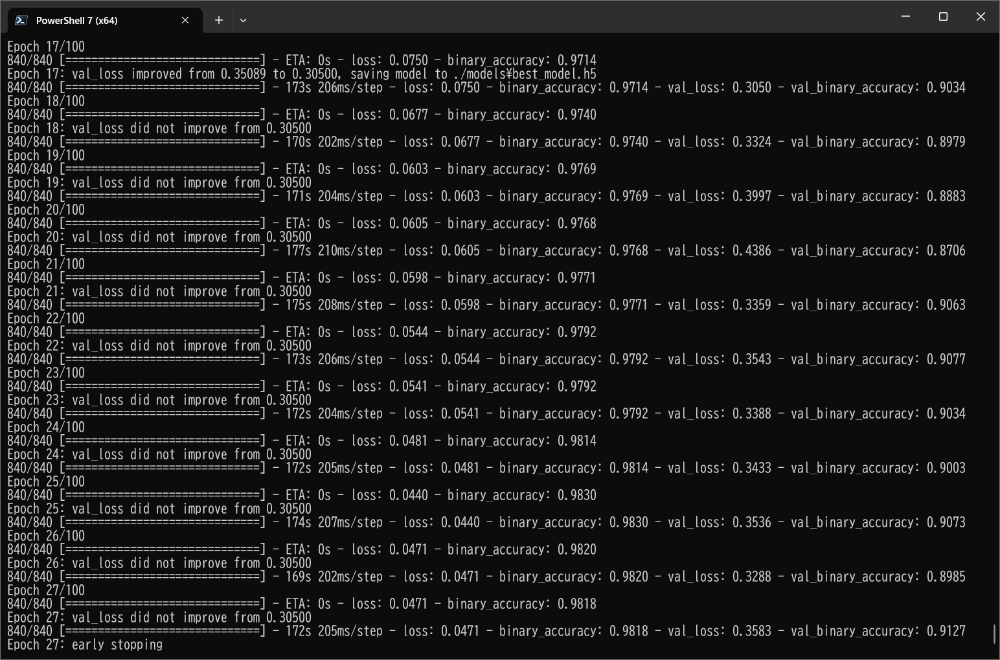

# TensorflowSwinUNet-Segmentation-Gastrointestinal-Polyp (Updated: 2023/07/06)

<h2>
1 TensorflowSwinUNet-Segmentation-Gastrointestinal-Polyp
</h2>

This is an experimental project detect Gastrointestinal-Polyp by using 
TensorflowSwinUNet Model, which is a Tensorflow 2 implementation of
<a href="https://arxiv.org/pdf/2105.05537.pdf">
<b>Swin-Unet: Unet-like Pure Transformer for Medical Image Segmentation</b>
</a>. 

In order to write the <a href="./TensorflowSwinUNet.py">TensorflowSwinUNet</a> Python class, we have used the Python code in the following web sites.

<pre>
1.keras-unet-collection
 https://github.com/yingkaisha/keras-unet-collection/tree/main/keras_unet_collection
</pre>

Please see also:

<pre>
2. U-Net: Convolutional Networks for Biomedical Image Segmentation
 https://arxiv.org/pdf/1505.04597.pdf
</pre>
<pre>
3.Swin-Unet: Unet-like Pure Transformer for Medical Image Segmentation
https://arxiv.org/pdf/2105.05537.pdf
</pre>

The image dataset used here has been taken from the following web site.

<pre>
Kvasir-SEG Data (Polyp segmentation & detection)
https://www.kaggle.com/datasets/debeshjha1/kvasirseg
</pre>

See also: 
<a href="https://github.com/atlan-antillia/Image-Segmentation-Gastrointestinal-Polyp">Image-Segmentation-Gastrointestinal-Polyp</a>
 

<h2>
2 Prepare dataset
</h2>

<h3>
2.1 Download master dataset
</h3>
 Please download the original dataset from the following link 
<pre>
Kvasir-SEG Data (Polyp segmentation & detection)
https://www.kaggle.com/datasets/debeshjha1/kvasirseg
</pre>
<b>Kvasir-SEG</b> dataset has the following folder structure. 
<pre>
Kvasir-SEG
├─annotated_images
├─bbox
├─images
└─masks
</pre>

<h3>
2.2 Create master dataset
</h3>
We have split <b>images</b> and <b>masks</b> dataset in Kvasir-SEG to <b>test</b>, <b>train</b> and <b>valid</b> dataset 
by using Python <a href="./projects/GastrointestinalPolyp/generator/create_master_256x256.py">create_master_256x256.py</a> script,
by which we have also resized all images and masks files in <b>train</b> and <b>valid</b> to be 256x256 and 
applied some rotation and flip operations to the resized images to augment those dataset.    
<pre>
GastrointestinalPolyp
├─test
│  ├─images
│  └─masks
├─train
│  ├─images
│  └─masks
└─valid
    ├─images
    └─masks
</pre>
<b>Augmented image samples: GastrointestinalPolyp/train/images</b> 
 
<b>Augmented mask samples: GastrointestinalPolyp/train/mask</b> 
 

<h2>
3. Create TensorflowSwinUNet Model
</h2>
 You can customize your <a href="./TensorflowSwinUNet.py">TensorflowSwinUNet</a> model by using a configration file. 
 The following is the case of Gastrointestinal-Polyp segmentation dataset. 
Please note that loss and metrics in model section, which is of course a first experiment. 
<pre>
loss    = "binary_crossentropy"
metrics = ["binary_accuracy"]
</pre>
 
<pre>
; train_eval_infer.config
; 2023/07/04 antillia.com
; Modified to use loss and metric
;
; #Oxford IIIT image segmentation with SwinUNET
; #https://github.com/yingkaisha/keras-vision-transformer/blob/main/examples/Swin_UNET_oxford_iiit.ipynb

[model]
image_width    = 256
image_height   = 256
image_channels = 3
num_classes    = 1
filter_num_begin = 128   
; number of channels in the first downsampling block; it is also the number of embedded dimensions

depth = 4
; the depth of SwinUNET; depth=4 means three down/upsampling levels and a bottom level 

stack_num_down = 2         
; number of Swin Transformers per downsampling level

stack_num_up = 2
; number of Swin Transformers per upsampling level

patch_size = (4, 4)        
; Extract 4-by-4 patches from the input image. Height and width of the patch must be equal.  

num_heads = [4, 8, 8, 8]   
;number of attention heads per down/upsampling level

window_size = [4, 2, 2, 2] 
;the size of attention window per down/upsampling level

num_mlp = 512              
; number of MLP nodes within the Transformer

shift_window=True          
;Apply window shifting, i.e., Swin-MSA

;Optimizer Adam 1e-4?
learning_rate  = 0.0001
clipvalue      = 0.3

;loss           = "bce_iou_loss"
;loss           = "dice_loss"
;loss           = "iou_loss"
loss           = "binary_crossentropy"

metrics        = ["binary_accuracy"]
;metrics        = ["iou_coef"]

show_summary   = False

[train]
epochs        = 100
batch_size    = 4
patience      = 10
metrics       = ["binary_accuracy", "val_binary_accuracy"]
;metrics       = ["iou_coef", "val_iou_coef"]

model_dir     = "./models"
eval_dir      = "./eval"

image_datapath = "./GastrointestinalPolyp/train/images/"
mask_datapath  = "./GastrointestinalPolyp/train/masks/"
create_backup  = False

[eval]
image_datapath = "./GastrointestinalPolyp/test/images/"
mask_datapath  = "./GastrointestinalPolyp/test/masks/"

[infer] 
images_dir    = "./mini_test" 
output_dir    = "./mini_test_output"
merged_dir    = "./mini_test_output_merged"

[mask]
blur      = True
binarize  = True
threshold = 128
</pre>

 
You will pass the filename of this configuration file to <a href="./TensorflowSwinUNet.py">TensorflowSwinUNet</a> constructor to create your model 
in the following way: 
<pre>
  config_file = "./train_eval_infer.config"
  model       = TensorflowSwinUNet(config_file)
</pre>

<h2>
4 Train TensorflowSwinUNet Model
</h2>
 We can create and train your TensorflowSwinUNet model by Gastrointestinal-Polyp dataset defined in the <b>train_eval_infer.config</b> file. 

We can use <a href="./ImageMaskDataset.py">ImageMaskDataset</a> class to create <b>train</b> and <b>test</b> dataset in 
<b>./projects/GastrointestinalPolyp/GastrointestinalPolyp.</b> 
Please move to <b>./projects/Gastrointestinal-Polyp/</b>, and run the following bat file.
<pre>
>1.train.bat
</pre>
which simply runs the Python script 
<a href="./TensorflowSwinUNetTrainer.py">TensorflowSwinUNetTrainer.py</a>
<pre>
python ../../TensorflowSwinUNetTrainer.py ./train_eval_infer.config
</pre>

<b>Training console output</b> 

 
 
<b>Train metrics: binary_accuracy</b>. 
 

 
<b>Train losses: binary_crossentropy</b> 
 

<h2>
5 Evaluation
</h2>
 We can evaluate the prediction(segmentation) accuracy in <b>test</b> dataset by using our Trained TensorflowSwinUNet Model,
and <b>train_eval_infer.config</b> file. 
Please move to <b>./projects/Gastrointestinal-Polyp/</b>, and run the following bat file.
<pre>
>2.evaluate.bat
</pre>
, which runs the Python script 
<a href="./TensorflowSwinUNetEvaluator.py">TensorflowSwinUNetEvaluator.py</a>
<pre>
python ../../TensorflowSwinUNetEvaluator.py ./train_eval_infer.config
</pre>
<b>Evaluation console output</b> 
 
 

<h2>
6 Inference 
</h2>
We have also tried to infer the segmented region for <b>mini_test</b> dataset, which is a very small dataset including only 
ten images extracted from <b>test</b> dataset,
 by using our Pretrained  GastrointestinalPolyp Model. 
<pre>
>3.infer.bat
</pre>
, which simply runs the following command. 
<pre>
>python ../../TensorflowSwinUNetInferencer.py train_eval_infer.config
</pre>

<b>Input images (mini_test) </b> 
 
 

<b>Ground truth mask (mini_test_mask) </b> 
 
 

<b>Inferred images (mini_test_output)</b> 
Some white polyp regions in the original images of the mini_test dataset above have been detected as shown below.
 
 
<b>Merged inferred images blended with the orignal images and inferred images</b> 
  

 

 
<h3>
References
</h3>

<b>1.Swin-Unet: Unet-like Pure Transformer for Medical Image Segmentation</b> 
Hu Cao, Yueyue Wang, Joy Chen, Dongsheng Jiang, Xiaopeng Zhang, Qi Tian, and Manning Wang 
<pre>
https://arxiv.org/pdf/2105.05537.pdf
</pre>

<b>2.keras-unet-collection</b> 
<pre>
 https://github.com/yingkaisha/keras-unet-collection/tree/main/keras_unet_collection
</pre>

<b>3.Image-Segmentation-Gastrointestinal-Polyp</b> 
Toshiyuki Arai @antillia.com
 
<pre>
https://github.com/atlan-antillia/Image-Segmentation-Gastrointestinal-Polyp
</pre>

<b>4.TensorflowUNet3Plus-Segmentation-Gastrointestinal-Polyp</b> 
Toshiyuki Arai @antillia.com
 
<pre>
https://github.com/sarah-antillia/TensorflowUNet3Plus-Segmentation-Gastrointestinal-Polyp
</pre>

<b>5. Semantic-Segmentation-Loss-Functions (SemSegLoss)</b> 
<pre>
https://github.com/shruti-jadon/Semantic-Segmentation-Loss-Functions
</pre>
<pre>
Citation
@inproceedings{jadon2020survey,
  title={A survey of loss functions for semantic segmentation},
  author={Jadon, Shruti},
  booktitle={2020 IEEE Conference on Computational Intelligence in Bioinformatics and Computational Biology (CIBCB)},
  pages={1--7},
  year={2020},
  organization={IEEE}
}
@article{JADON2021100078,
title = {SemSegLoss: A python package of loss functions for semantic segmentation},
journal = {Software Impacts},
volume = {9},
pages = {100078},
year = {2021},
issn = {2665-9638},
doi = {https://doi.org/10.1016/j.simpa.2021.100078},
url = {https://www.sciencedirect.com/science/article/pii/S2665963821000269},
author = {Shruti Jadon},
keywords = {Deep Learning, Image segmentation, Medical imaging, Loss functions},
abstract = {Image Segmentation has been an active field of research as it has a wide range of applications, 
ranging from automated disease detection to self-driving cars. In recent years, various research papers 
proposed different loss functions used in case of biased data, sparse segmentation, and unbalanced dataset. 
In this paper, we introduce SemSegLoss, a python package consisting of some of the well-known loss functions 
widely used for image segmentation. It is developed with the intent to help researchers in the development 
of novel loss functions and perform an extensive set of experiments on model architectures for various 
applications. The ease-of-use and flexibility of the presented package have allowed reducing the development 
time and increased evaluation strategies of machine learning models for semantic segmentation. Furthermore, 
different applications that use image segmentation can use SemSegLoss because of the generality of its 
functions. This wide range of applications will lead to the development and growth of AI across all industries.
}
}
</pre>
 

<h2>Appendix </h2>

To inspect TensorflowSwinNet Model structure, please move to <b>./projects/GastrointestinalPolyp</b>,
 and run the followin bat file. 
<pre>
>model_inspect.bat
</pre>
 

